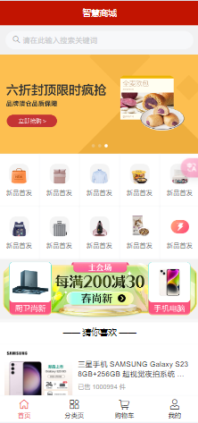
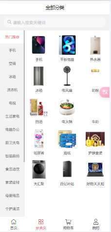
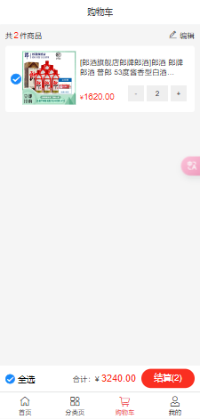
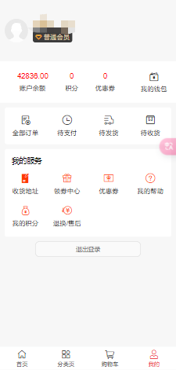

# Shopping-H5-Vue2 
# 基于 Vue2 的 H5 移动端商城

## 1.Preview
<div>




</div>

## 2. Reference
[黑马智慧商城](https://www.bilibili.com/video/BV1HV4y1a7n4?spm_id_from=333.788.videopod.episodes&vd_source=bad6777c11b618c6cc7845eb5b9d31a6&p=100)

## 3. API documentation
[智慧商城-实战项目-API](https://apifox.com/apidoc/shared-12ab6b18-adc2-444c-ad11-0e60f5693f66/doc-2221080)

## 4. setup
```
npm install
```

## 5. run
```
npm run serve
```

## 6. build
```
npm run build
```

## 7. Acknowledgement
* [Vue2](https://v2.cn.vuejs.org/)
* [黑马程序员](https://space.bilibili.com/37974444)

## 8.Contact
```
ligaoqi02@gmail.com
```